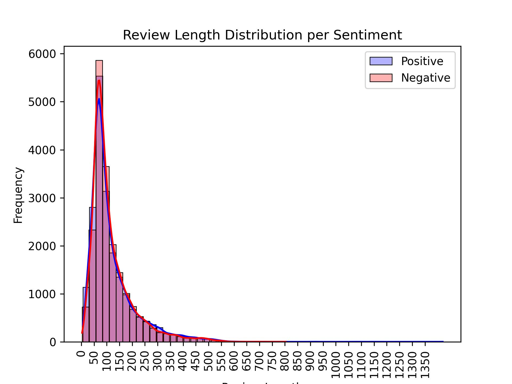
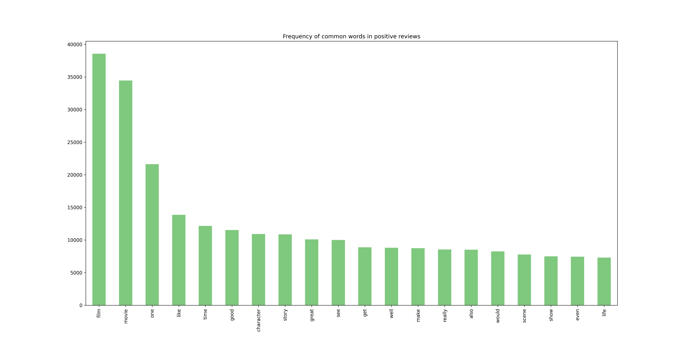
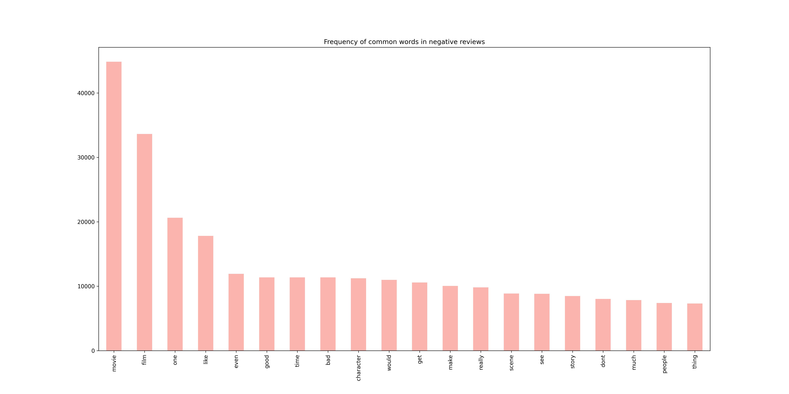

# Sentiment analysis

## Intro

This data science report aims to analyze the 50k Movie Reviews dataset, with exploratory data analysis (EDA), feature engineering, modeling, and considerations for potential business applications.  
**Detailed analysis done in notebook, can be used as reference.*

## EDA
### Dataset overview:
* dataset has 50k samples overall, 40k for train and 10k for inference
* there are 2 features: `review`(`dtype:str`) and `sentiment`(`dtype:str`)
* do not have missing values
* below word count distributions:

* most common words per sentiment after removing stopwords, html tags, urls etc.; did it for better comparison and cosistency:

### Class distributions:
* dataset is balanced with 20k for both positive and negative sentiment
* wordcloud of positive and negative sentiment

## Simple text preprocessing
* sentences lower cased
* removed irrelevant chars (punctuations, numberc, etc)
* removed HTML tags and URLs
* removed words with length less than 2
* documents tokenized (for further analysis)

### Stemming vs Lemmatization
* compared overall performance on simple logistig regression model and got almost identical results

### Stopwords removal
* removed stopwords as well as such words as `not`, `never`, `nor` because they do not carry a lot of information but unnecessary weight on sentiment behaviour
* removed `movie`, `film` and `one` as they have nothing to do with sentiment

### Vectorization
* used TF-IDF method on BoW technique with most frequent 7k words as this method gives more weight to common words than rare ones
* N-Gram Analysis done: Unigrams and Bigrams perfomance compared on baseline model (*Use notebook as reference*)
* unigrams on top of TF-IDF vectorization method chosen for further analysis as it overperfomed

## Modelling
### Baseline model:
* simple logistic regression model
* performed hyperparameter tuning (regularization), but it did not improve the accuracy :(
* accuracy: ~88%

### Random Forest Classifier
* model with 100 estimators and `max_depth=20`
* accuracy: 72%

### SVC
* model with `solver='linear'`
* could not do with rbf kernel due to time limits
* accuracy: 66%

## Model selection
Due to highest accuracy and relatively small time to train **Logistic Regression** was chosen as the best one

## Potential Business Applications and Value

Potential applications of the model in a business context and the value it provides

## Competetive advantage:
* businesses that effectively utilize sentiment analysis can gain a competitive advantage by staying attuned to customer preferences and making strategic decisions based on real-time feedback

## Customer Feedback Analysis for Platforms:
* identifying negative sentiment early on allows businesses to address issues promptly, minimizing potential damage to their brand or product reputation

## Content Recommendation Improvement:
* platforms providing movie recommendations can significantly improve user satisfaction by using sentiment analysis to refine and optimize their content recommendation algorithms

------------------------------------------------------------------

## Technical overview and instructions

### Data:
Data can be loaded with `/src/data_loader.py` script and saved in `/data/raw` directory via building Docker image. Training script will automatically cleanse and preprocess the data and save in `/data/processed` directory.

## Training:
The training phase of this project can be done by running `/src/training/train.py` script.
 To train the model using Docker following insturctions should be done: 
- Build the training Docker image using this command:

`docker build -f ./src/training/Dockerfile  --build-arg MODEL_NAME=<your_model_name.joblib> -t training_image .`

`model_name` can be replaced with `.joblib` extension to it.
- After successfull build, run the container that actually trains the model, and mounts `/outputs/models` and `/data` folders on container to your local machine by the following command:

`docker run -v $(pwd)/outputs/models:/app/outputs/models -v $(pwd)/data:/app/data training_image`

If you get an error, probably it is because there are some whitespaces in your printed working directory(pwd).
To handle this instead of using `pwd` write your project path by hand like:`/users/bebrulya/desktop/DS-final-task`.
In the shell (terminal, cmd) you can see the training phase with `logging.info` created by the script along with model's `accuracy` score.
Make sure that `train.csv` and `test.csv` created in `/data/raw` and `'clean_train.csv'` in `'/data/processed'` folder along with your model in `/outputs/models` folder.
## Inference
Once a model has been trained, it can be used to make predictions on new data in the inference stage. The inference stage is implemented in `/src/inference/inference_run.py`.
- Build the inference Docker image:

`docker build -f ./src/inference/Dockerfile -t inference_image .`

- Run the inference Docker container with following command:

`docker run -v $(pwd)/outputs/predictions:/app/outputs/predictions inference_image`

Make sure you don't get any errors related to your pathname (pwd). After succesfull run, inference phase can be shown in shell, and what's more important is that `/predictions` folder in container will be mounted on your local `/predictions` folder which keeps result of the models prediction (csv file)  on inference data.

## Extra
* Some exceptions are included in some problematic parts in the code.